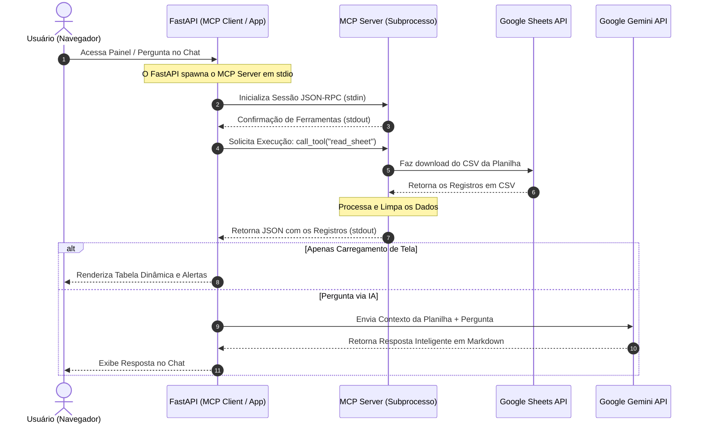

# Demonstração Visual e Arquitetura do Assistente

Este documento apresenta uma visão geral de como o **Assistente de Lembretes** funciona, como a comunicação do **Model Context Protocol (MCP)** foi implementada e quais são as partes principais do código.

---

## 🎨 Mockup Visual da Interface Web

Abaixo está o design premium implementado para o painel de controle da aplicação. O layout conta com cards de resumo dinâmicos, tabela inteligente com marcação de prazos em cores vibrantes, e uma área de chat para consultas diretas via IA.

> [!NOTE]
> O mockup visual foi gerado pela IA e salvo na pasta interna de artefatos da sessão.

---

## 🌐 Fluxo de Funcionamento com MCP

O **Model Context Protocol (MCP)** permite que um modelo de IA (ou o próprio backend) se conecte a fontes de dados externas por meio de um protocolo unificado. Neste projeto, a comunicação é feita através do transporte `stdio` (entrada/saída padrão de subprocesso):



---

## 💻 Código Comentado & Funcionamento

### 1. O MCP Server (`mcp_server/server.py`)
Utiliza a classe de alto nível `FastMCP` para criar o servidor de maneira limpa. Ele expõe a ferramenta `read_sheet`:

```python
from mcp.server.fastmcp import FastMCP
from sheets_tool import fetch_sheets_data

# Inicializa o servidor FastMCP
mcp = FastMCP("Google-Sheets-Reminder-Server")

@mcp.tool()
def read_sheet(sheet_id: str = None) -> str:
    """
    Lê os dados da planilha configurada do Google Sheets.
    Retorna uma string JSON contendo uma lista de objetos.
    """
    try:
        data = fetch_sheets_data(sheet_id)
        return json.dumps(data, ensure_ascii=False)
    except Exception as e:
        return json.dumps({"error": str(e)})

if __name__ == "__main__":
    # Executa o servidor usando stdin/stdout como canal de transporte JSON-RPC
    mcp.run(transport="stdio")
```

### 2. O MCP Client (`services/sheets_service.py`)
Responsável por criar o subprocesso do servidor MCP e trocar mensagens JSON-RPC:

```python
from mcp import ClientSession, StdioServerParameters
from mcp.client.stdio import stdio_client

class SheetsService:
    async def get_tasks(self) -> list:
        # Define os parâmetros para iniciar o servidor MCP como subprocesso
        server_params = StdioServerParameters(
            command=sys.executable,  # Usa o Python do ambiente virtual
            args=["mcp_server/server.py"]
        )
        
        # Conecta no canal stdio do subprocesso do servidor
        async with stdio_client(server_params) as (read_channel, write_channel):
            async with ClientSession(read_channel, write_channel) as session:
                # Inicializa e negocia ferramentas
                await session.initialize()
                
                # Executa a ferramenta 'read_sheet' exposta pelo servidor
                result = await session.call_tool("read_sheet")
                return json.loads(result.content[0].text)
```

---

## 📈 Lógica de Alertas Visuais no Frontend (`static/app.js`)
No frontend, lemos os registros e calculamos prazos em relação à data atual do sistema:

- **Atrasado (Classe CSS `.task-delayed` - Destaque em Vermelho)**:
  Quando a tarefa está pendente e a data prevista é anterior à data de hoje.
  $$\text{Data Prevista} < \text{Data de Hoje}$$
- **Próximo do Vencimento (Classe CSS `.task-upcoming` - Destaque em Amarelo)**:
  Quando a tarefa está pendente e a data prevista vence nos próximos 3 dias.
  $$\text{Data de Hoje} \le \text{Data Prevista} \le \text{Data de Hoje} + 3\text{ dias}$$
